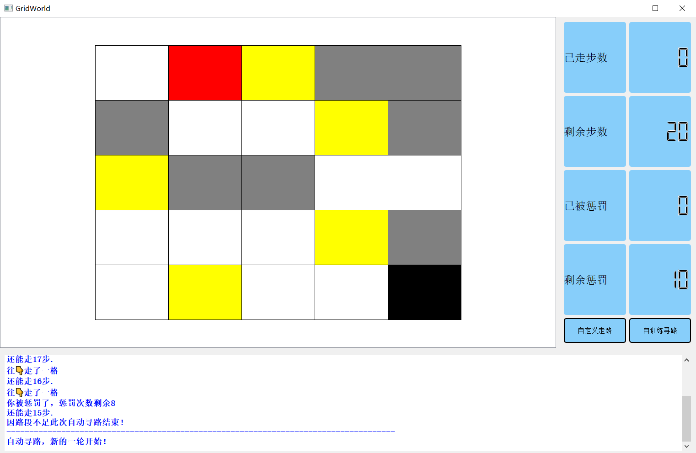

# 使用说明
> 这是一个网格世界生成器，灰色为禁行区（特征2）、黄色为可行区但是会受到惩罚（特征1）、白色为可行区（特征0）、蓝色为起点（特征3）、黑色为终点（特征4）

## 需要传入给main函数的参数分别是：
- grids 符合上面特征的二维列表，可以用generate_grid生成（返回一个grids和start_point）
- start_point 起点列表，包含两个数据
- width 网格界面宽度
- height 网格界面高度
- tolerance 惩罚容忍次数

## 效果
